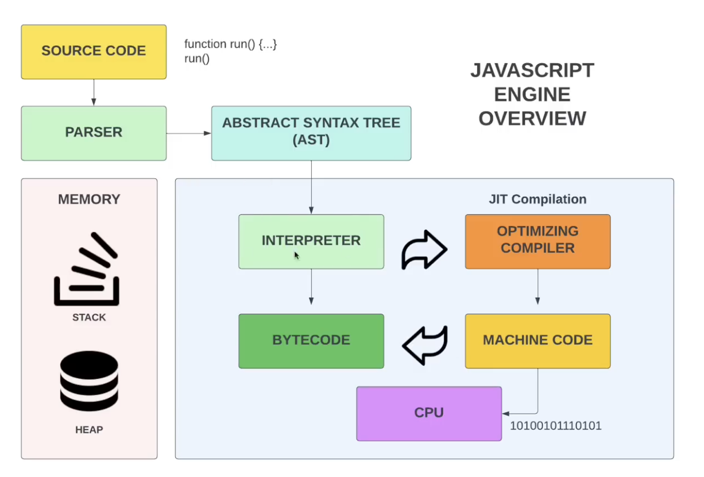

# JavaScript Engine 

A JavaScript engine is a program or an interpreter which reads the JavaScript code, parses the code and executes the instructions.

Popular JavaScript engines are:

1. V8 (Chrome and Node.js)
2. SpiderMonkey (Firefox)
3. JavaScriptCore (Safari)
4. Chakra (Microsoft Edge) : This is a legacy version

## Parsing and Compilation 

The first step in the execution of JavaScript code is parsing and compilation. 

### Parsing

This step contains the following sub-steps:

1. **Lexical Analysis(Tokenization)**: The code is broken down into tokens. A token is a sequence of characters that form a single unit. For example, the code `var a = 10;` will be broken down into the following tokens: `var`, `a`, `=`, `10`, `;`. This process involves decoding the byte stream into tokens.

2. **Syntax Analysis**: The tokens are analyzed to determine the structure of the code and how the tokens relate to each other. This step involves building an abstract syntax tree (AST) which represents the hierarchical structure of the code.

3. **Semantic Analysis**: The AST is analyzed to check for any semantic errors and to assign meaning to the code. This step involves checking for variable declarations, function definitions, and resolving references to variables and functions.


### Compilation

Once the code has been parsed, it is compiled into machine code. The compilation process involves the following steps:

- **Intermediate Representation (IR)**: The AST is converted into an intermediate representation (IR) which is a low-level representation of the code. The IR is then optimized to improve the performance of the code.

- **Machine Code Generation**: The IR or AST is compiled into bytecode, a lower-level representation of the code. Bytecode is platform-independent and can be executed by the engine’s interpreter.

- **Optimization**: The engine may perform various optimizations on the bytecode to improve performance.


## Just In Time (JIT) Compilation

JavaScript engines use a technique called Just-In-Time (JIT) compilation to improve the performance of the code. JIT compilation involves compiling the code at runtime, just before executing it. This allows the engine to optimize the code based on runtime information and produce highly optimized machine code.


### Optimizing JIT Compilation

JavaScript engines use several techniques to optimize the code during JIT compilation:

1. **Inlining**: Functions are inlined to reduce the overhead of function calls. Inlining involves replacing the function call with the actual code of the function.

```javascript
function add(a, b) {
  return a + b;
}

function sum(x, y) {
  return add(x, y); // This call can be inlined
}

// After inlining:
function sum(x, y) {
  return x + y;
}
```

2. **Type Inference**: The engine infers the types of variables and optimizes the code based on the types. This allows the engine to generate more efficient machine code. by type inference, we mean that the engine can predict the type of a variable based on its usage in the code.

```javascript
function multiply(a, b) {
  return a * b; // The engine can infer 'a' and 'b' are numbers
}

multiply(2, 3); // The types are inferred and optimized
```

3. **Loop Optimization**: Loops are optimized to reduce the overhead of loop iterations. This involves unrolling loops, eliminating redundant checks, and optimizing loop conditions.

```javascript
for (let i = 0; i < 100; i++) {
  // Original loop
}

// After unrolling:
for (let i = 0; i < 100; i += 4) {
  // Unrolled loop body
  // Iteration 1
  // Iteration 2
  // Iteration 3
  // Iteration 4
}
```

4. **Garbage Collection**: The engine uses garbage collection to reclaim memory that is no longer in use. Garbage collection is an essential part of memory management in JavaScript.

```javascript
let obj = { a: 1 };
obj = null; 
```

5. **Profiling**: The engine profiles the code to gather runtime information and optimize the code based on the profiling data. This allows the engine to generate highly optimized machine code.

```javascript
function add(a, b) {
  return a + b;
}

for (let i = 0; i < 1000; i++) {
  add(i, i); // Profiling data shows this function is called frequently
}

// The engine uses this data to optimize the add function
```

## Garbage Collection

Garbage collection is the process of automatically reclaiming memory that is no longer in use by the program. JavaScript engines use garbage collection to manage memory and prevent memory leaks.

JavaScript engines use several garbage collection algorithms to reclaim memory:

1. **Mark-and-Sweep**: This is the most common garbage collection algorithm used by JavaScript engines. The algorithm works by marking objects that are reachable from the root and sweeping away objects that are not reachable.

    - **Mark**: The garbage collector traverses the object graph starting from the root and marks all objects that are reachable.
    - **Sweep**: The garbage collector sweeps through the heap and reclaims memory from objects that are not marked.

2. **Generational Collection**: This algorithm divides objects into different generations based on their age. Young objects are collected more frequently than old objects. This algorithm is based on the observation that most objects die young.

    - **Young Generation**: Newly created objects are placed in the young generation. The garbage collector collects objects in the young generation more frequently.
    - **Old Generation**: Objects that survive multiple collections are promoted to the old generation. The garbage collector collects objects in the old generation less frequently.

## JavaScript Engine v8




This image provides an overview of the JavaScript engine's operation process, illustrating how JavaScript code is transformed and executed. Let's break it down step-by-step:

### 1. **Source Code**
The process begins with the JavaScript source code, which is the script written by the developer.

### 2. **Parser**
The source code is fed into the parser, which performs lexical analysis and syntax analysis:
- **Lexical Analysis:** Converts the source code into tokens.
- **Syntax Analysis:** Uses these tokens to generate an Abstract Syntax Tree (AST).

### 3. **Abstract Syntax Tree (AST)**
The AST is a hierarchical tree structure that represents the syntactic structure of the code. It is used to understand the code's structure and semantics.

### 4. **Interpreter**
The AST is passed to the interpreter (in V8, this would be the Ignition interpreter), which converts the AST into bytecode. Bytecode is an intermediate representation that is easier to execute than high-level source code.

### 5. **Bytecode**
The bytecode is executed by the interpreter. While the bytecode is running, the engine collects profiling data about the code's execution, such as which functions are called frequently and the types of variables.

### 6. **Optimizing Compiler (JIT Compilation)**
Based on the profiling data, the optimizing compiler (in V8, this would be the TurboFan compiler) kicks in to further optimize the bytecode:
- **Optimization:** The compiler applies various optimizations, such as inlining functions, type specialization, and eliminating dead code.
- **Compilation to Machine Code:** The optimized code is then compiled into highly efficient machine code, which can be executed directly by the CPU.

### 7. **Machine Code**
The machine code is the final, highly optimized version of the code that runs directly on the CPU. This results in much faster execution compared to interpreting the bytecode alone.

### 8. **Memory Management**
During the entire process, memory is managed using stack and heap structures:
- **Stack:** Used for managing function calls and local variables.
- **Heap:** Used for dynamically allocated memory, such as objects and arrays.

### Summary
- **Source Code:** Written by the developer.
- **Parser:** Converts source code into an AST.
- **AST:** Represents the code structure.
- **Interpreter:** Converts AST into bytecode.
- **Bytecode:** Executed by the interpreter while collecting profiling data.
- **Optimizing Compiler:** Uses profiling data to optimize bytecode and compile it into machine code.
- **Machine Code:** The final optimized code executed by the CPU.
- **Memory Management:** Handled using stack and heap.


