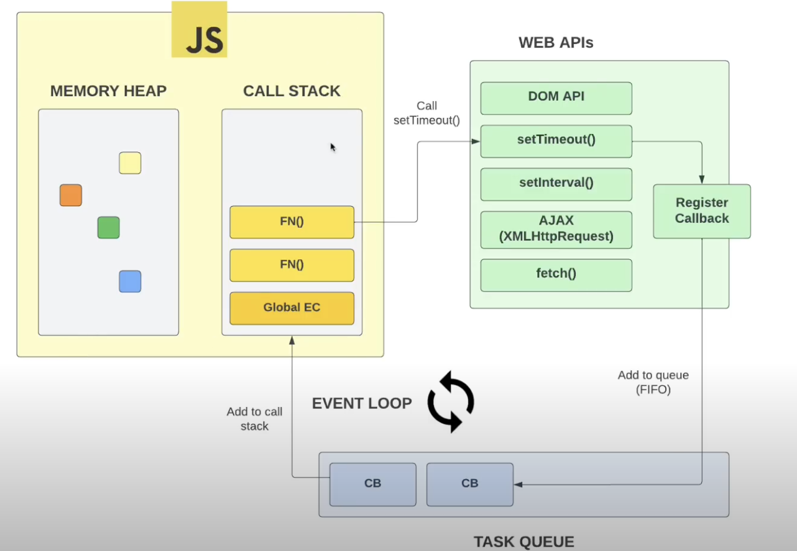
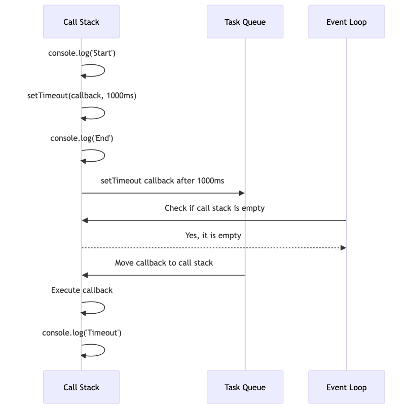
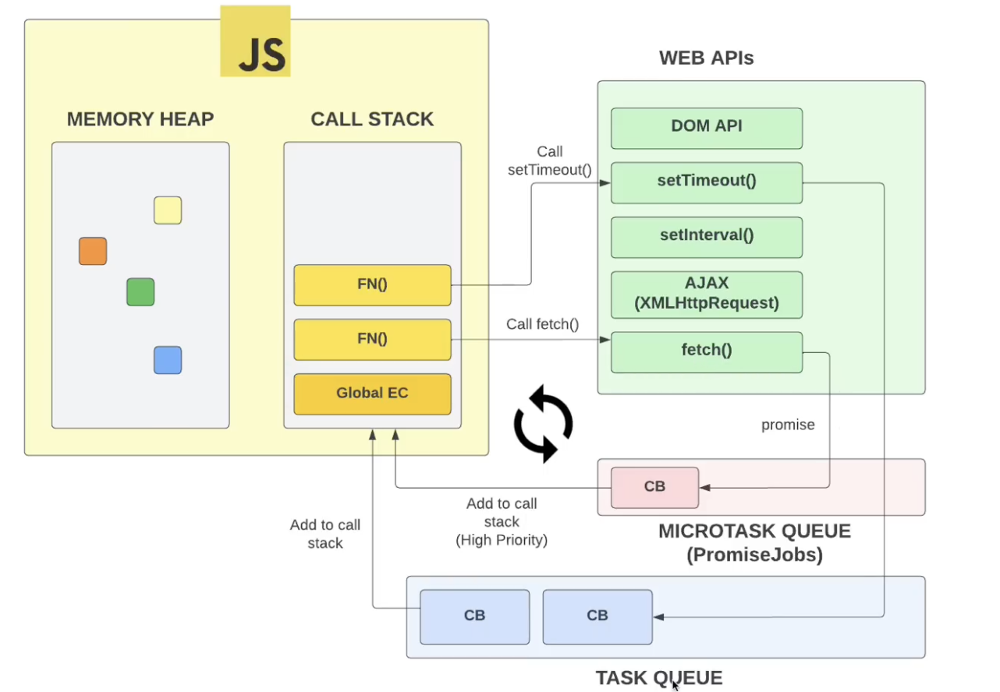

#  Asynchronous JavaScript, Task Queue & Event Loop

JavaScript is a single-threaded language, meaning it can only execute one task at a time. However, it has asynchronous capabilities that allow it to perform non-blocking operations. This is achieved through the event loop, task queue, and callback functions.

## Blocking Operations

Blocking operations are operations that prevent the execution of other tasks until they are completed. For example, fetching data from an API, reading a file, or waiting for a user input are blocking operations. In a synchronous environment, these operations would block the main thread, making the application unresponsive.

```javascript
// Blocking operation
function fetchData() {
  const data = fetch('https://api.example.com/data');
  console.log(data);
}

fetchData();
```

In the example above, the `fetchData` function fetches data from an API synchronously. This operation would block the main thread until the data is fetched, making the application unresponsive.

## Blocking vs Non-Blocking

In a non-blocking environment, tasks can be executed concurrently without waiting for the completion of other tasks. This allows the application to remain responsive and handle multiple operations simultaneously.

```javascript
// Non-blocking operation
function fetchData() {
  fetch('https://api.example.com/data')
    .then(data => console.log(data));
}

fetchData();
```

In the example above, the `fetchData` function fetches data from an API asynchronously using promises. This operation is non-blocking, allowing other tasks to be executed while waiting for the data to be fetched.

We used callbacks to handle the asynchronous nature of JavaScript.

## Callback Functions

Callback functions are functions that are passed as arguments to other functions and are executed after the completion of a task. They are commonly used to handle asynchronous operations in JavaScript.

## Browser Web APIs



### Example using setTimeout

```javascript
console.log('Start');

setTimeout(() => {
  console.log('Timeout');
}, 1000);

console.log('End');
```

In the example above, the `setTimeout` function is a Web API provided by the browser that allows us to execute a function after a specified delay. The `setTimeout` function is non-blocking and schedules the callback function to be executed after 1000ms. The output of the code would be:

```
Start
End
Timeout // This is executed after 1000ms which is 1 second
```

## Task Queue & Event Loop

- The task queue (or event queue) is a queue of tasks (or events) that are waiting to be executed.
- The event loop is a mechanism that continuously checks the call stack and the task queue. It ensures that tasks from the task queue are moved to the call stack for execution when the stack is empty.


### How it works ?

#### Call Stack

JavaScript maintains a call stack where it keeps track of function calls.
When a function is called, it is pushed onto the call stack. When it returns, it is popped off the call stack.

#### Task Queue

When an asynchronous operation completes, its callback is placed in the task queue.
Examples of asynchronous operations include timers (setTimeout, setInterval), network requests (XHR, fetch), and events (click, mouseover).

#### Event Loop

The event loop continuously monitors the call stack and the task queue.
If the call stack is empty, the event loop pushes the first task from the task queue to the call stack, where it is executed.
This process ensures that JavaScript can handle asynchronous operations non-blocking, despite being single-threaded.




## Promises and microtasks queue



For promises, it does not work the same way as the task queue. Promises have their own queue called the microtask queue.
When a promise is resolved or rejected, its callback is placed in the microtask queue.
Microtasks have a higher priority than tasks in the task queue, and they are executed before the next task is picked from the task queue.

## async & await vs Promises

1. Syntax and readability:

```javascript
// Promises
function fetchData() {
  return fetch('https://api.example.com/data')
    .then(response => response.json());
}

fetchData()
  .then(data => console.log(data))
  .catch(error => console.error(error));
```

```javascript
// async & await
async function fetchData() {
  try {
    const response = await fetch('https://api.example.com/data');
    const data = await response.json();
    return data;
  } catch (error) {
    console.error(error);
  }
}

await fetchData();
```

async & await provides a more synchronous way of writing asynchronous code, making it easier to read and understand.

2. Error handling:

```javascript
// Promises
fetch('https://api.example.com/data')
  .then(response => response.json())
  .then(data => console.log(data))
  .catch(error => console.error(error));
```

```javascript
// async & await
try {
  const response = await fetch('https://api.example.com/data');
  const data = await response.json();
  console.log(data);
} catch (error) {
  console.error(error);
}
```

Promises use .catch() for error handling, while async/await uses try/catch blocks, which is more similar to synchronous code.

3. Chaining vs sequential:

Promises use .then() for chaining operations, while async/await allows for a more sequential, synchronous-looking code structure.

4. Underlying mechanism:

async/await is built on top of promises, and it provides a more elegant way of handling asynchronous code.

5. Browser support:

Promises have wider browser support, while async/await is supported in more recent browser versions.

6. Parallel execution:

```javascript
// Promises
Promise.all([promise1, promise2, promise3])
  .then(results => console.log(results));

// async & await
const [result1, result2, result3] = await Promise.all([promise1, promise2, promise3]);
console.log(result1, result2, result3);
```


