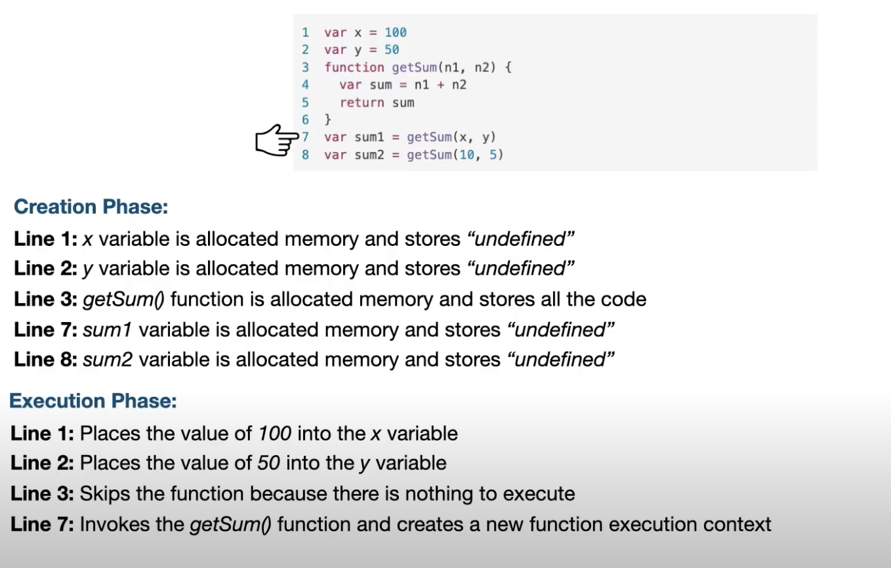
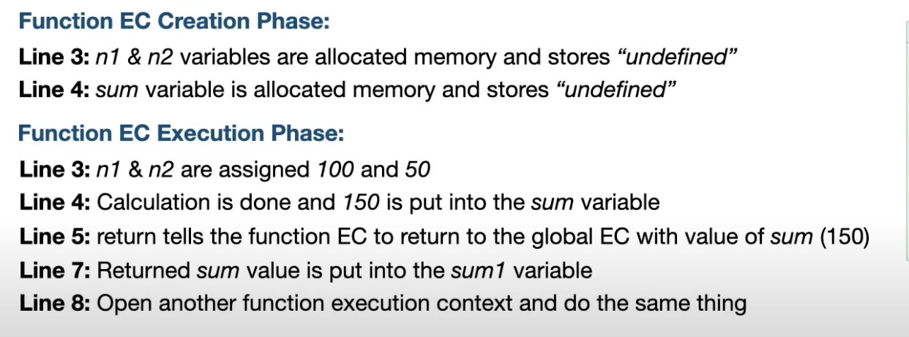
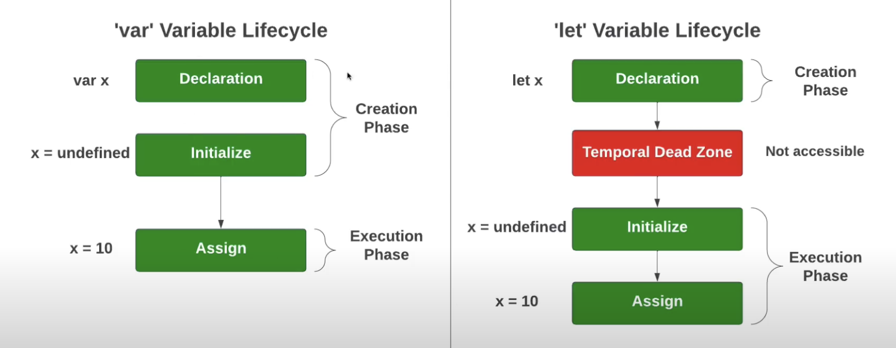

# Execution Context

Whenever a JavaScript program is executed, a new execution context is created. The execution context is a data structure that contains information about the environment in which the code is executed. It consists of three main components:

There is a global execution context as well as a function execution context. The global execution context is created when the program starts, and a new function execution context is created each time a function is called.


## Types of Execution Context

There are two types of execution contexts in JavaScript:

1. **Global Execution Context**: The global execution context is created when the program starts. It consists of two main components:

    - **Global Object**: The global object is the top-level object in the JavaScript environment. In the browser, the global object is the `window` object. In Node.js, the global object is the `global` object.

    - **This**: The `this` keyword refers to the global object in the global execution context.

Example:

```javascript
console.log(this); // window (in the browser)
console.log(this); // global (in Node.js)
```

2. **Function Execution Context**: A new function execution context is created each time a function is called. It consists of three main components:

    - **Variable Environment**: The variable environment contains the function's arguments, local variables, and inner function declarations.

    - **Scope Chain**: The scope chain contains references to the function's lexical environment and the lexical environments of its parent functions.

    - **This**: The `this` keyword refers to the function's execution context.

Example:

```javascript
function greet() {
  console.log(this); // window (in the browser)
}

greet();
```

## Execution Context Phases

The execution context goes through two main phases:

1. **Creation Phase**: 
    - Create the global object (`window` in the browser, `global` in Node.js).
    - Create the `this` object and bind it to the global object.
    - Setup memory heap for variables and functions.
    - Store functions and variables in global execution context and set their initial values to `undefined`.

2. **Execution Phase**: 
    - Execute the code line by line.
    - Create a new function execution context for each function call.





## Hoisting

Hoisting is a JavaScript mechanism where variables and function declarations are moved to the top of their containing scope during the compilation phase. This means that you can use a variable or function before it has been declared.

This is an elementary definition of hoisting. In reality, it has to do with the creation and execution phases of the execution context.

Example:

```javascript
console.log(x); // undefined
var x = 100;
var y = 50;
console.log(getSum(x, y)); // 150
function getSum(a, b) {
  return a + b;
}
```

In the example above, the function `getSum` is called before it is declared. This works because during the creation phase, the function declaration is hoisted to the top of the execution context.

x is also hoisted, but it is initialized to `undefined` during the creation phase. That's why the first `console.log(x)` prints `undefined`.

## Var vs Let/Const

Example:

```javascript
console.log(x); // ReferenceError: Cannot access 'x' before initialization
let x = 100;
```

In the example above, using `let` instead of `var` results in a `ReferenceError`.
Some references say that `let` and `const` are not hoisted, but they are hoisted to the top of the block scope, not the global scope. They exist in another area of memory called the Temporal Dead Zone (TDZ).



